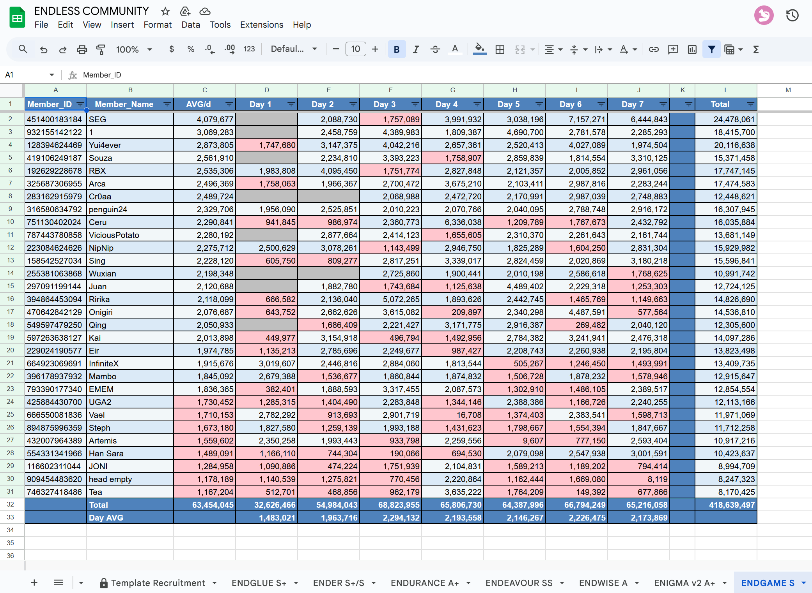

# Uma Club Tracking

**Disclaimer: This is a fan-made automatic program.**

This software automates the process of fetching club friend history data from [uma.moe](https://uma.moe/) and exporting it into a formatted Google Spreadsheet. The output includes automated styling, borders, totals, averages, and conditional formatting for enhanced readability.



## Overview

The application streamlines data tracking for Uma Musume clubs by:

- Retrieving latest club data.
- Formatting data into a clear, professional Google Sheet.
- Handling distinct club profiles concurrently or individually.

For users preferring a pre-compiled solution, please visit the [Releases](https://github.com/mquangpham575/Uma_Club_Fan_Tracking/releases/tag/v1.0) page. The following setup instructions are intended for developers or users running the source code directly.

## Features

- **Automated Formatting:** Headers and totals are styled for high visibility.
- **Visual Aids:** Alternating row colors and automatic borders.
- **Conditional Formatting:**
  - Red highlights for values below defined thresholds.
  - Grey background for empty cells.
- **Auto-Summarization:** Automatic calculation of totals and averages.
- **Scalability:** Supports parallel exporting for multiple clubs.

## Setup

### Prerequisites

- Python 3.x installed.
- A Google Cloud Project with the Google Sheets API enabled.

### Installation

1. **Clone or Download:**
   - Click **Code** -> **Download ZIP** and extract, or clone the repository via Git.

2. **Google API Credentials:**
   - A `credentials.json` file is required to authenticate with Google Sheets.
   - Refer to this [video tutorial](https://youtu.be/zCEJurLGFRk) (01:59 - 06:50) for instructions on creating a Service Account Key.
   - Rename the downloaded key file to `credentials.json` and place it in the `config/` directory.
   - **Important:** Share the target Google Sheet with the Service Account's `client_email` (Editor access).

3. **Configuration:**
   - Open `config/globals.py` to configure the `SHEET_ID` and club details:

   ```python
   SHEET_ID = "YOUR_SPREADSHEET_ID"

   CLUBS = {
       "1": {"title": "EndGame", "URL": "...", "THRESHOLD": 1800000},
       # Add other clubs as needed
   }
   ```

## Usage

### 1. Local Execution

First, ensure you have the dependencies installed. This project uses [uv](https://docs.astral.sh/uv/) for fast dependency management:

```bash
uv sync
```

To execute the program, run the provided batch script:
`Script_run.bat`

Alternatively, execute via command line using uv:

```bash
uv run python src/main.py
```

#### Operation

Upon running locally, select an operation mode:

```text
=== Choose a club to export ===

1. EndGame
...
0. Export ALL clubs (default)
```

- **Enter 0 or Press Enter:** Exports all configured clubs in parallel.
- **Enter Number:** Exports only the selected club.

Each club will be generated as a separate worksheet within the specified Google Spreadsheet. Note that existing sheets with the same name will be deleted and recreated.

### 3. ChronoScraper (Backup Browser Scraper)

In cases where the standard API fetch is restricted or fails, use the **ChronoScraper**. This tool uses browser automation to simulate a real user and intercept the required network packets.

- **Purpose**: A reliable backup for manual data extraction.
- **Requirement**: Requires [Microsoft Edge](https://www.microsoft.com/edge) or a Chromium-based browser (configured in `chrono/chrono_scraper.py`).

#### Running the Scraper

The ChronoScraper is designed to be highly portable:

1. **Portable EXE**: Take the `ChronoScraper.exe` from the `dist/` folder and place it directly **inside** your `chrono/` folder (alongside your `credentials.json` and `globals_*.py` files).
2. **Simplified Configs**: Each `globals_*.py` inside the `chrono/` folder should follow this format:
   ```python
   SHEET_ID = "YOUR_SPREADSHEET_ID"
   CLUBS = {
       "1": {"title": "FrailFrame", "club_id": "283921372", "THRESHOLD": 1000000},
       "2": {"title": "ChillFrame", "club_id": "474350360", "THRESHOLD": 1000000},
   }
   ```
3. **Via UV (Devs)**:
   ```bash
    uv run chrono/main.py
   ```

## Build Instructions (Windows)

To bundle the application into standalone executables:

1. **Main Application:**

   ```bash
   uv run pyinstaller --onefile --noconfirm --clean --icon=assets/app_icon.ico --name "UmaTracker" --paths . src/main.py --add-data "config;config"
   ```

2. **Chrono Scraper (Backup):**

   ```bash
    uv run pyinstaller --onefile --name "ChronoScraper" --icon "assets/app_icon.ico" --add-data "chrono;chrono" --paths "." --collect-all pandas --collect-all gspread --collect-all zendriver chrono/main.py
   ```

3. **Locate the output:**
   The compiled files will be available in the `dist/` directory.

## Notes

- **Standalone EXE**: The `ChronoScraper.exe` is designed to be placed directly **inside** the `chrono/` folder. It will automatically detect any `globals_*.py` and `credentials.json` files in its immediate directory.
- To change the destination Google Sheet for the main app, update the `SHEET_ID` variable in `globals.py`.
- The application automatically handles the deletion and recreation of sheets during export.


